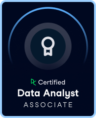

# Hi, I'm Ilya A. Mukhatov

**Aspiring Data Analyst | Career Transitioner from Technical Operations to Data Intelligence**  
Ottawa, Canada | Focused on turning complex data into actionable insights  

---

## About Me

I'm a former Electrical Technologist with 5+ years of experience in the healthcare industry (Abbott Point of Care), now transitioning into the world of **Data Analytics and Data Science**.

My journey is driven by curiosity, a passion for optimization, and a commitment to continuous learning. I've earned multiple DataCamp certifications (SQL Associate, Data Analyst Associate, and in progress: Data Engineer Associate), and I’m using this foundation to build real-world, data-driven solutions across domains like sports analytics, manufacturing, and public health.

---

## Tools & Technologies

**Languages & Querying:**  
`Python`, `SQL`, `PostgreSQL`, `Snowflake SQL`

**Analytics & Visualization:**  
`Power BI`, `Tableau`, `Jupyter Notebook`

**Data Engineering & Workflow Tools:**  
`dbt`, `MS Access`, `Power Query`, `VBA`, `Git/GitHub`

---

## Featured Projects

### 📊 [UEFA Champions League Analytics (2020–2022)](https://github.com/yourusername/uefa-champions-league-analytics)
*Snowflake SQL & Python*  
Exploratory and tactical performance insights drawn from UEFA Champions League match data. Includes advanced SQL queries, team comparisons, and Python visualizations.

### ⚙️ [Evaluating a Manufacturing Process using SQL & Python](https://github.com/yourusername/spc-manufacturing-analysis)
*SPC & Process Optimization*  
A real-world inspired project that applies SQL and Python to assess process stability using SPC techniques. Includes alert rate diagnostics and operator performance tracking.

### 🗽 [NYC Restaurant Inspection Analysis (In Progress)](https://github.com/yourusername/nyc-restaurant-inspection)
*PostgreSQL & Tableau*  
Ongoing public health analysis of restaurant inspection data, visualized through Tableau dashboards to reveal trends and critical violations by cuisine and borough.

---

## Certifications

  
**DataCamp SQL Associate** – Earned May, 2025*

  
**DataCamp Data Analyst Associate** – Earned May, 2025*

---

## Currently Learning

- Data modeling and dbt workflows  
- A/B testing and experimentation frameworks  
- Real-time data pipelines & analytics engineering  

---

## My Transition Story

After years of working with hardware, lab systems, and automation, I realized the future lies in **making data work smarter**. My goal is to bring analytical rigor and domain understanding into projects that improve decisions—whether in healthcare, manufacturing, or urban systems.

---

## Let’s Connect

- 🔗 [Portfolio Website (GitHub Pages)](https://i-mukhatov.github.io)  
- 📧 Email: a.mukhatov@gmail.com  
- 💼 [LinkedIn](https://www.linkedin.com/in/ilyamukhatov/)  
- 🧠 Always open to collaboration, learning, and feedback!

---

> *“Data is only as valuable as the action it inspires.” – That’s the principle guiding everything I build.*  
